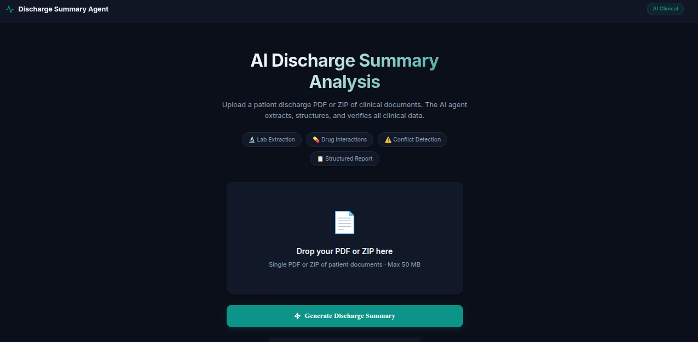
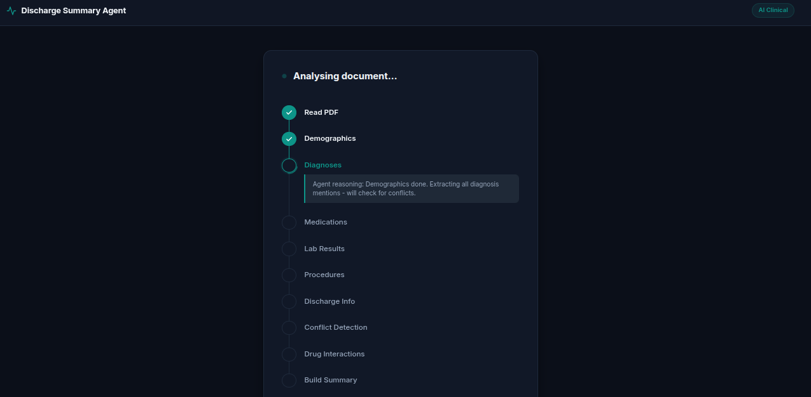
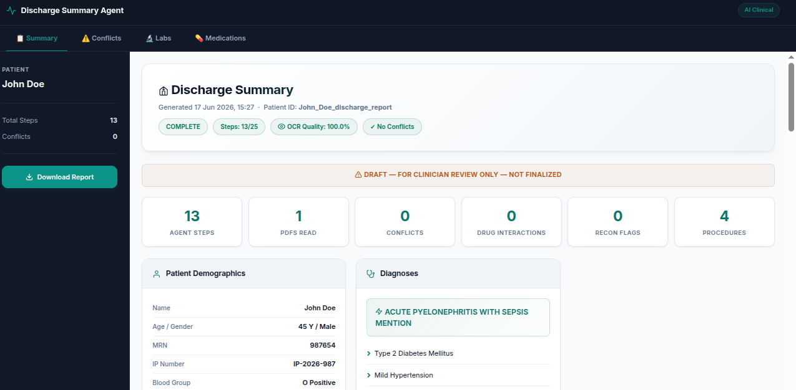
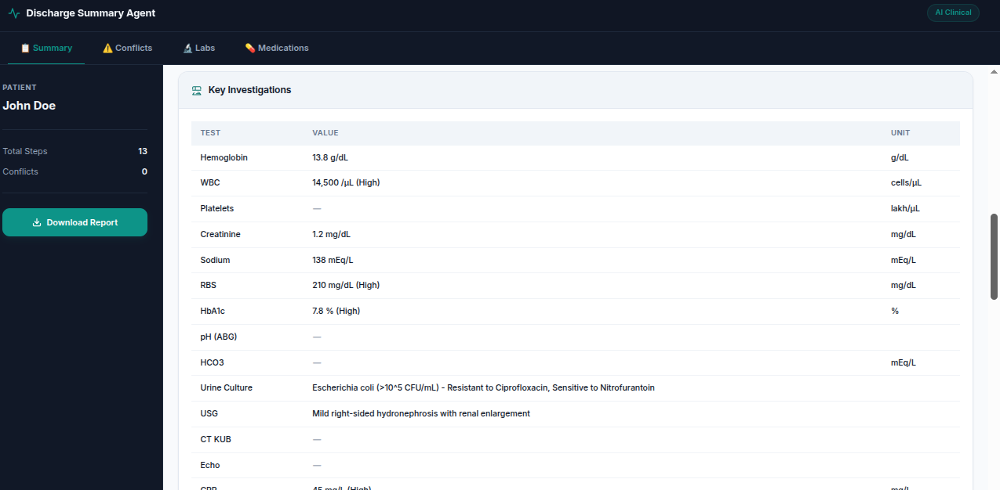
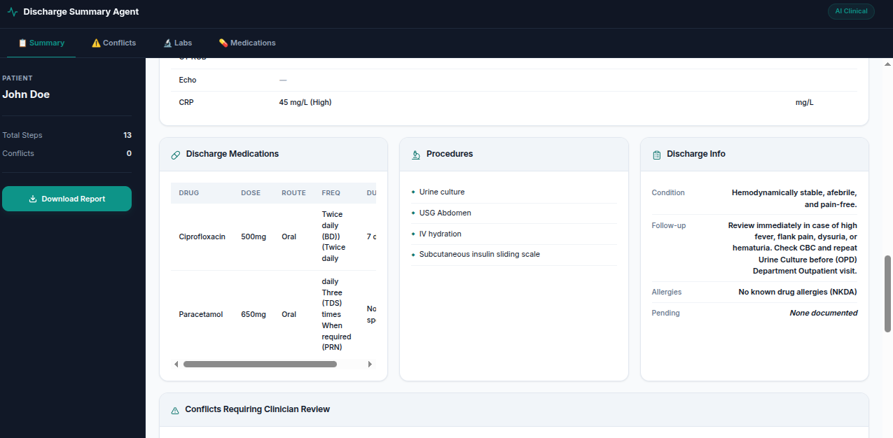
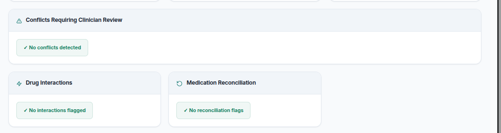

# CliniDraft AI

An intelligent medical assistant that automates the generation of patient discharge summaries from clinical documents.

[](https://www.python.org/)
[](https://opensource.org/licenses/Apache-2.0)

Links:
* [Repository](https://github.com/utkarsh-aix/clinical-discharge-agent)

## Why This Exists

Writing patient discharge summaries manually from fragmented clinical notes, laboratory reports, and hospital charts is time-consuming and error-prone. Inaccuracies or missed data can lead to poor transition of care and medication errors.

CliniDraft AI solves this by deploying a deterministic state-machine agent powered by Google Gemini (`gemini-2.5-flash`). It parses patient records, extracts structured clinical information, audits for inconsistencies, and drafts print-ready summaries for clinician review.

## Features

* **Deterministic Agent Loop:** A multi-step state machine that ensures structured and repeatable data extraction.
* **Clinical Safety Guardrails:** Strict instructions to prevent data fabrication. Missing fields are left for clinician validation.
* **Conflict & Inconsistency Detector:** Scans across admission notes, progress updates, and labs to flag discrepancies in dates, diagnoses, or medication reconciliations.
* **Multi-Fallback OCR Pipeline:** Robust parsing of digital and scanned PDFs utilizing `pdfplumber`, Tesseract OCR, EasyOCR, and Gemini Vision.
* **Interactive Clinician Dashboard:** A clean, steel-blue interface featuring live execution logs, patient analytics, and warning notifications.
* **Print-Ready Exports:** Instantly generate professional HTML and PDF summaries for patient handoff.
* **Simulated Doctor Review:** A closed loop that computes edit distances and refines future drafts through persistent memory.

## Screenshots

### 1. Document Upload Page
Provides a simple web portal for uploading single patient PDFs or ZIP archives containing multi-document patient records.


### 2. Document Analysis & Execution Trace
Displays the real-time planner running through its multi-step agentic loop and reporting reasoning logs.


### 3. Main Dashboard & Patient Info Page
Visual overview of demographics, extracted diagnoses, and metrics including steps taken, conflicts found, and procedures completed.


### 4. Key Investigations Page
Extracts, structures, and maps lab results and vital statistics into clear tabular formats.


### 5. Medications, Procedures & Discharge Info Page
Captures all prescriptions, route, frequency, and duration alongside critical follow-up plans.


### 6. Clinical Safety & Conflicts Panel
Highlights cross-document inconsistencies (LAMA status, diagnosis mismatches) and medication reconciliation flags for direct clinician review.


## Tech Stack

* **Language:** Python 3.10+
* **LLM & Orchestration:** Google Gemini API (`google-generativeai`)
* **Web Dashboard:** Flask, HTML5, CSS3 (Steel-blue light theme)
* **Document Processing:** Tesseract OCR (`pytesseract`), Poppler (`pdf2image`), `pdfplumber`, `PyPDF2`, `EasyOCR`
* **Resilience:** Tenacity (retries with exponential backoff)
* **Report Generation:** ReportLab (print-ready PDF exports)

## Quick Start

### Clone

```bash
git clone https://github.com/utkarsh-aix/clinical-discharge-agent.git
cd clinical-discharge-agent/discharge_summary_agent
```

### Install

Ensure you have `tesseract-ocr` and `poppler-utils` installed on your system.

**Linux:**
```bash
sudo apt update && sudo apt install -y tesseract-ocr poppler-utils
```

Install Python packages:
```bash
pip install -r requirements.txt
```

### Configure Environment

Create a `.env` file in the root of the `discharge_summary_agent` directory:
```env
GEMINI_API_KEY=your_gemini_api_key_here
```

### Run

#### Start Web Interface:
```bash
python3 app.py
```
Open [http://localhost:5000](http://localhost:5000) in your browser.

#### Start via CLI (for multi-document folders):
```bash
python3 main.py --patient-folder patients/patient_2 --max-steps 25
```

## Usage

* **Upload Patient Records:** Upload a single patient PDF or a `.zip` archive containing a folder of patient records (admission notes, progress notes, lab results).
* **Track Extraction:** View the real-time planner running through its multi-step agentic loop reporting reasoning logs.
* **Audit & Reconcile:** Inspect the conflicts panel to resolve medication or diagnostic inconsistencies.
* **Export Summary:** Click download to generate a print-ready PDF summary for patient handoff.

## Project Structure

```
discharge_summary_agent/
├── agent/
│   ├── loop.py               # Main agent execution loop
│   ├── state.py              # Agent state tracker
│   ├── tracer.py             # Execution tracer
│   ├── reviewer.py           # Doctor edit simulator (Phase 2)
│   ├── feedback.py           # Draft scoring module (Phase 2)
│   ├── correction_memory.py  # Persistent learning store (Phase 2)
│   └── evaluate.py           # Evaluation runner CLI
├── extractors/
│   ├── demographics.py       # Demographic and allergy extraction
│   ├── diagnoses.py          # Principal & secondary diagnoses extraction
│   ├── medications.py        # Admission, inpatient & discharge meds extraction
│   ├── labs.py               # Lab and vital results extraction
│   ├── procedures.py         # Surgical and procedural extraction
│   ├── discharge_info.py     # Discharge disposition & follow-up extraction
│   └── hospital_course.py    # Hospital course narrative extraction
├── tools/
│   ├── pdf_reader.py         # Digital PDF parsing & multi-fallback OCR
│   ├── conflict_detector.py  # Clinical conflict and inconsistency auditor
│   ├── drug_interaction.py   # Drug-to-drug interaction checker
│   ├── escalation.py         # Clinician flagging and review router
│   └── hallucination_check.py# Hallucination Shield verification
├── output/
│   ├── html_report.py        # HTML summary generator
│   ├── pdf_report.py         # Print-ready PDF compiler
│   └── summary_builder.py    # Core summary drafting and reconciliation
├── templates/
│   └── ui.html               # Frontend dashboard template
├── app.py                    # Flask web interface
├── main.py                   # Command-line runner
└── requirements.txt          # Python dependencies
```

## Roadmap

* [x] Multi-step agentic state machine pipeline
* [x] Automated clinical conflict detection
* [x] Fallback OCR extraction (EasyOCR & Gemini Vision)
* [x] Print-ready PDF report generation
* [x] Persistent doctor-correction memory (Phase 2)
* [ ] Multi-tenant role-based clinician access control
* [ ] Direct FHIR/HL7 electronic health record (EHR) integration
* [ ] Live collaborative draft editing interface

## Contributing

Please submit issues and pull requests to the main repository. Ensure all tests and mock runs pass before proposing changes.

## License

Distributed under the Apache License 2.0. See `LICENSE` for details.
