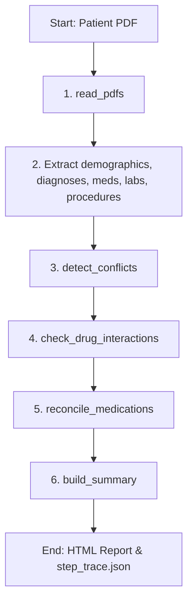

# Discharge Summary Agent

A robust, multi-step agentic AI system for generating structured, clinically safe discharge summaries from patient PDF records. Powered by **Google Gemini (`gemini-2.5-flash`)**.

---

## 🚀 How to Run

### 1. Install System Dependencies
Install OCR and PDF rendering tools:
```bash
sudo apt update && sudo apt install -y tesseract-ocr poppler-utils
```

### 2. Install Python Packages
```bash
pip install -r requirements.txt
```

### 3. Configure the Environment
Create a `.env` file at the root of the project:
```env
GEMINI_API_KEY=your_gemini_api_key_here
```

### 4. Run the Web Dashboard
```bash
python3 app.py
```
Open **`http://localhost:5000`** in your browser.

### 5. Run via CLI
```bash
python3 main.py --patient-folder patients/patient_2 --max-steps 25
```

---

## 🏥 Agent Loop Design

The agent uses a state-driven planning loop rather than a hardcoded pipeline. After executing each step, the planner (`agent/planner.py`) evaluates the current state and decides which tool to run next.



---

## 🛡️ Clinical Safety & Guardrails

### 1. No-Fabrication Guardrail
- **Refusal to Guess**: System instructions explicitly restrict the model from inventing any clinical fact. If information is not found, the model must return `null` or `[PENDING]`.
- **Clinician Review Mapping**: Any unextracted field is rendered as `—` (Not Documented) and flagged visually on the dashboard to force manual verification.

### 2. Failure Handling
- **Tenacious Retries**: All LLM calls are wrapped with exponential backoff retries (`tenacity`) to handle network timeouts.
- **Quota Fail-Safe**: If the API key hits quota limits (429 errors), the loop terminates early and alerts the user rather than silently producing incomplete reports.

### 3. Conflict & Inconsistency Handling
- **Cross-Document Auditing**: `tools/conflict_detector.py` checks for mismatched discharge dates, conflicting diagnoses, and discharge status (e.g. standard discharge vs. Left Against Medical Advice). Conflicts are escalated directly to the reviewer.

---

## 🔮 Limitations & Future Work

- **Rate Limits**: The Gemini free tier is subject to strict limits (20 requests/day). Upgrading to a pay-as-you-go key removes this bottleneck.
- **Context Chunking**: For exceptionally long hospital stays (+100 pages), pre-filtering pages using keyword matches (e.g., searching for "Discharge", "Medication List", "Course") will optimize token usage.
